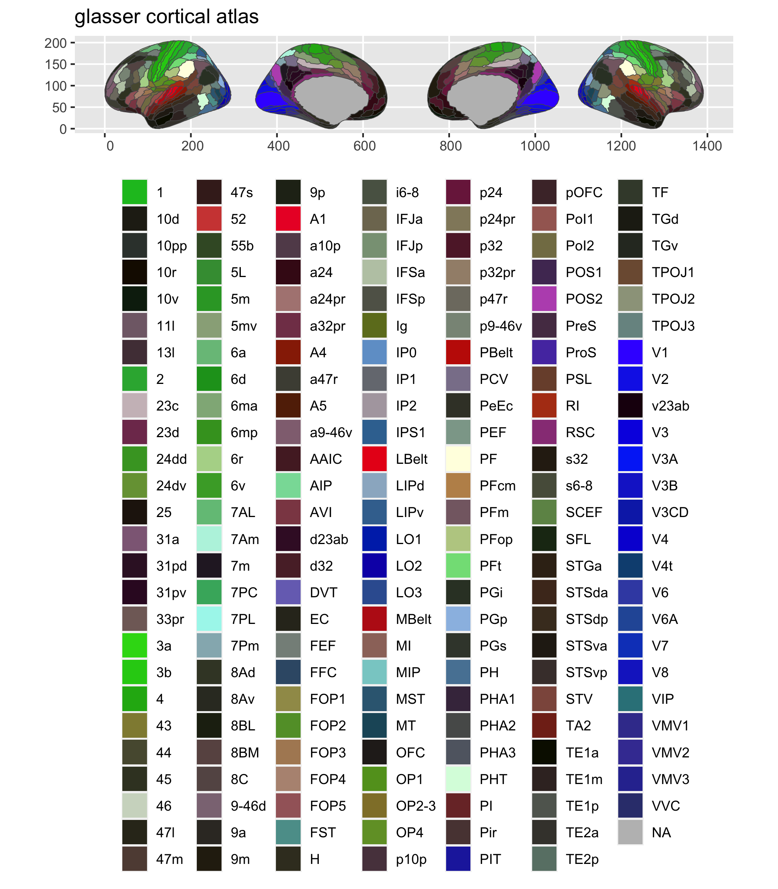

<!-- README.md is generated from README.Rmd. Please edit that file -->

# ggsegGlasser

<!-- badges: start -->

[](https://ci.appveyor.com/project/LCBC-UiO/ggsegGlasser)
[](https://travis-ci.com/LCBC-UiO/ggsegGlasser)
[](https://codecov.io/gh/LCBC-UiO/ggsegGlasser?branch=master)
<!-- badges: end -->

The goal of ggsegGlasser is to …

## Installation

You can install the released version of ggsegGlasser from
[CRAN](https://CRAN.R-project.org) with:

``` r
install.packages("ggsegGlasser")
```

And the development version from [GitHub](https://github.com/) with:

``` r
# install.packages("devtools")
devtools::install_github("LCBC-UiO/ggsegGlasser")
```

## Example

This is a basic example which shows you how to solve a common problem:

``` r
library(ggsegGlasser)
```

``` r
library(ggseg)

ggseg(atlas = glasser, mapping = aes(fill = region)) +
  scale_fill_brain("glasser", package = "ggsegGlasser") +
  theme(legend.position = "bottom",
        legend.text = element_text(size = 9)) +
  guides(fill = guide_legend(ncol = 7))
```



``` r
library(ggseg3d)

ggseg3d(atlas = glasser_3d) %>% 
  pan_camera("right lateral")
```


Please note that the ‘ggsegGlasser’ project is released with a
[Contributor Code of Conduct](CODE_OF_CONDUCT.md). By contributing to
this project, you agree to abide by its terms.
