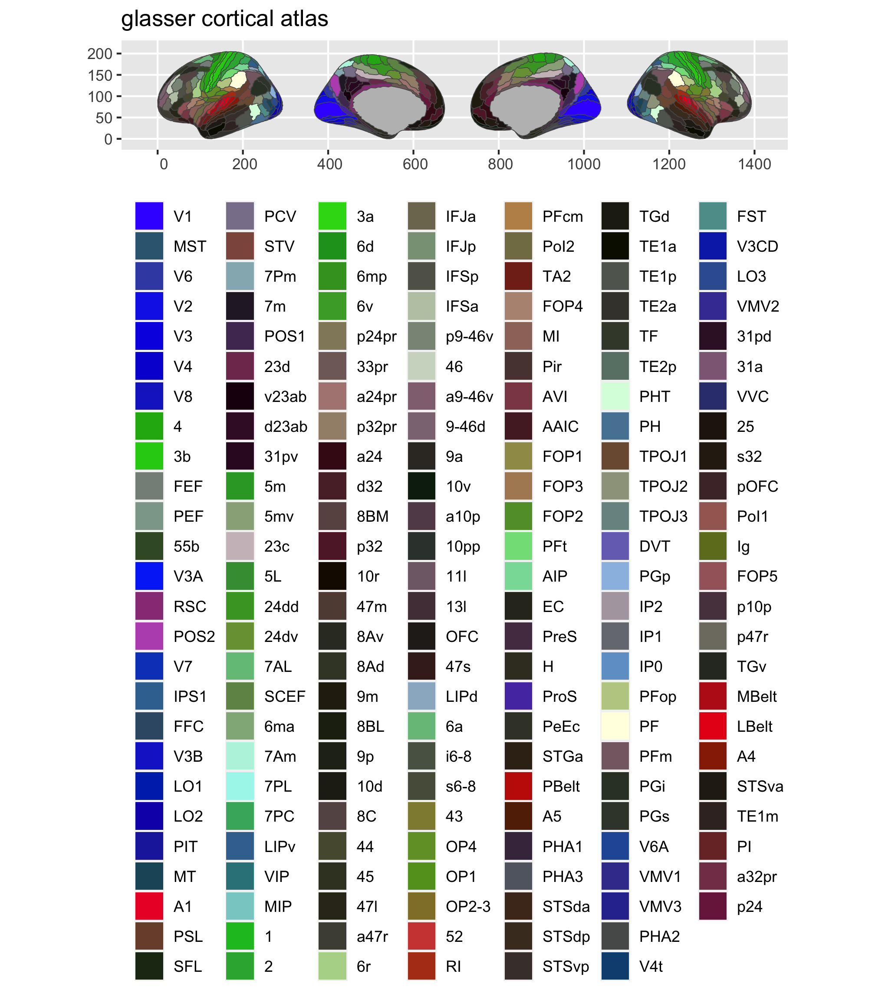

<!-- README.md is generated from README.Rmd. Please edit that file -->

# ggsegGlasser 

<!-- badges: start -->

[](https://zenodo.org/badge/latestdoi/250278991)
[](https://codecov.io/gh/LCBC-UiO/ggsegGlasser?branch=master)
[](https://github.com/LCBC-UiO/ggsegGlasser/actions)
<!-- badges: end -->

This repository contains an R package with atlas data for ggseg and
ggseg3d for the Glasser parcellation for HPC.

Glasser et al. (2016) Nature, volume 536, pages 171–178
[pubmed](https://www.nature.com/articles/nature18933)

## Installation

We recommend installing the ggseg-atlases through the ggseg
[r-universe](https://ggseg.r-universe.dev/ui#builds):

``` r
# Enable this universe
options(repos = c(
    ggseg = 'https://ggseg.r-universe.dev',
    CRAN = 'https://cloud.r-project.org'))

# Install some packages
install.packages('ggsegGlasser')
```

You can install the released version of ggsegGlasser from
[CRAN](https://CRAN.R-project.org) with:

``` r
install.packages("ggsegGlasser")
```

And the development version from [GitHub](https://github.com/) with:

``` r
# install.packages("devtools")
devtools::install_github("LCBC-UiO/ggsegGlasser")
```

## Example

This is a basic example which shows you how to solve a common problem:

``` r
library(ggsegGlasser)
```

``` r
library(ggseg)
library(ggplot2)

plot(glasser) +
  theme(legend.position = "bottom",
        legend.text = element_text(size = 9)) +
  guides(fill = guide_legend(ncol = 7))
```



``` r
library(ggseg3d)
library(dplyr)

ggseg3d(atlas = glasser_3d) %>% 
  pan_camera("right lateral")
```


Please note that the ‘ggsegGlasser’ project is released with a
[Contributor Code of Conduct](CODE_OF_CONDUCT.md). By contributing to
this project, you agree to abide by its terms.
